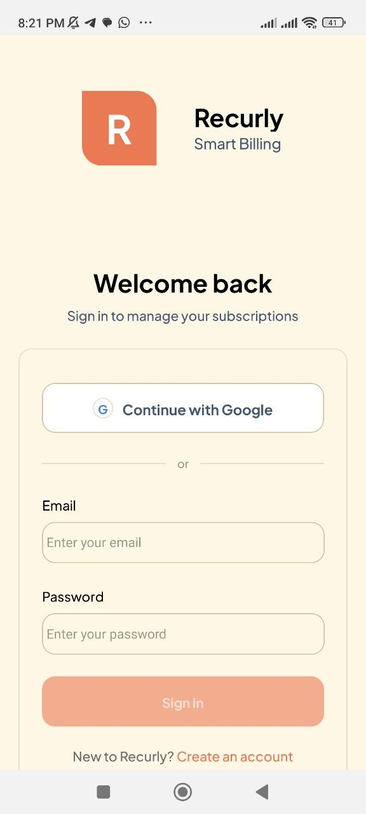
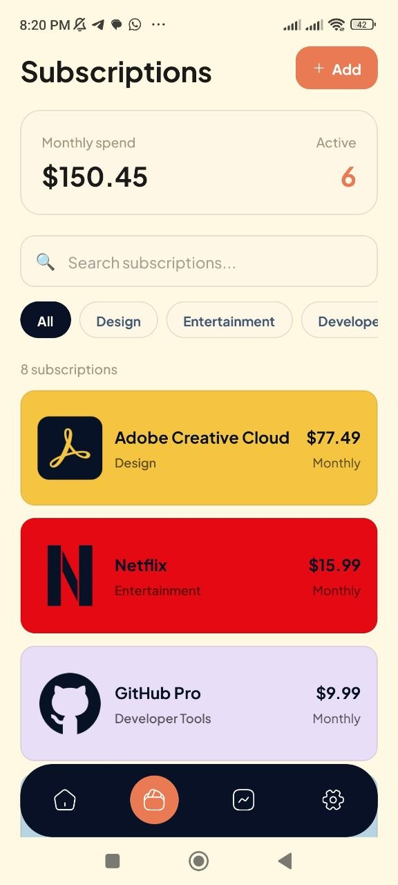
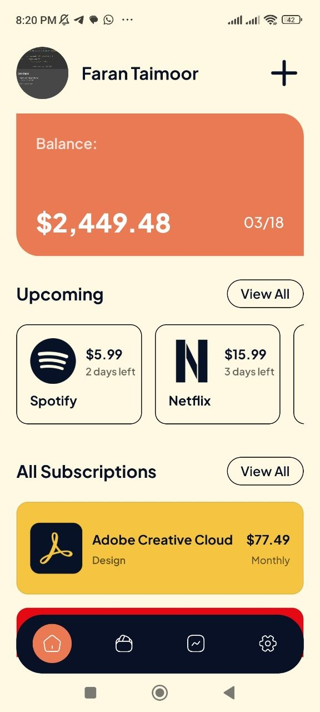

# Recurly - Smart Subscription Management

Recurly is a modern, mobile-first subscription management application designed to help users track, analyze, and optimize their recurring expenses. Built with Expo, React Native, and NativeWind, it offers a seamless experience for managing everything from streaming services to professional software licenses.

## 🚀 Features

- **Centralized Dashboard**: View all your active subscriptions in one place with total monthly and yearly expenditure.
- **Detailed Insights**: Visualize your spending habits with intuitive charts and analytics to identify where your money goes.
- **Smart Notifications**: Never get surprised by a renewal again with customizable alerts for upcoming payments.
- **Multi-Category Tracking**: Categorize subscriptions (Entertainment, Utilities, Software, etc.) for better organization.
- **Onboarding & Auth**: Secure and user-friendly authentication flow including onboarding for new users.

## UI




## 🛠 Tech Stack

- **Framework**: [Expo](https://expo.dev/) (SDK 54)
- **UI Library**: [React Native](https://reactnative.dev/)
- **Styling**: [NativeWind](https://www.nativewind.dev/) (Tailwind CSS for React Native)
- **Navigation**: [Expo Router](https://docs.expo.dev/router/introduction/) (File-based routing)
- **Animations**: [React Native Reanimated](https://docs.swmansion.com/react-native-reanimated/)
- **Language**: [TypeScript](https://www.typescriptlang.org/)

## 🏃 Getting Started

### Prerequisites

- Node.js (v18 or newer)
- pnpm (Recommended) or npm/yarn
- Expo Go app on your physical device or an Emulator/Simulator

### Installation

1. Clone the repository:
   ```bash
   git clone https://github.com/faranbutt/recurly.git
   cd recurly
   ```

2. Install dependencies:
   ```bash
   pnpm install
   ```

3. Start the development server:
   ```bash
   pnpm start
   ```

### Running on Devices

- **Android**: Press `a` in the terminal or use an Android Emulator.
- **iOS**: Press `i` in the terminal or use an iOS Simulator (macOS only).
- **Web**: Press `w` to run in the browser.

## 📂 Project Structure

```text
├── app/                  # Expo Router directory
│   ├── (auth)/           # Authentication routes (Sign In, Sign Up)
│   ├── (tabs)/           # Main application tabs (Subscriptions, Insights, Settings)
│   ├── onboarding.tsx    # User onboarding flow
│   └── _layout.tsx       # Root layout configuration
├── assets/               # Static assets (images, fonts)
├── components/           # Reusable UI components
├── constants/            # App constants and theme configuration
└── scripts/              # Utility scripts
```

## 📝 License

This project is private and for development purposes.

---

Built with ❤️ by [Faran Butt](https://github.com/faranbutt)
